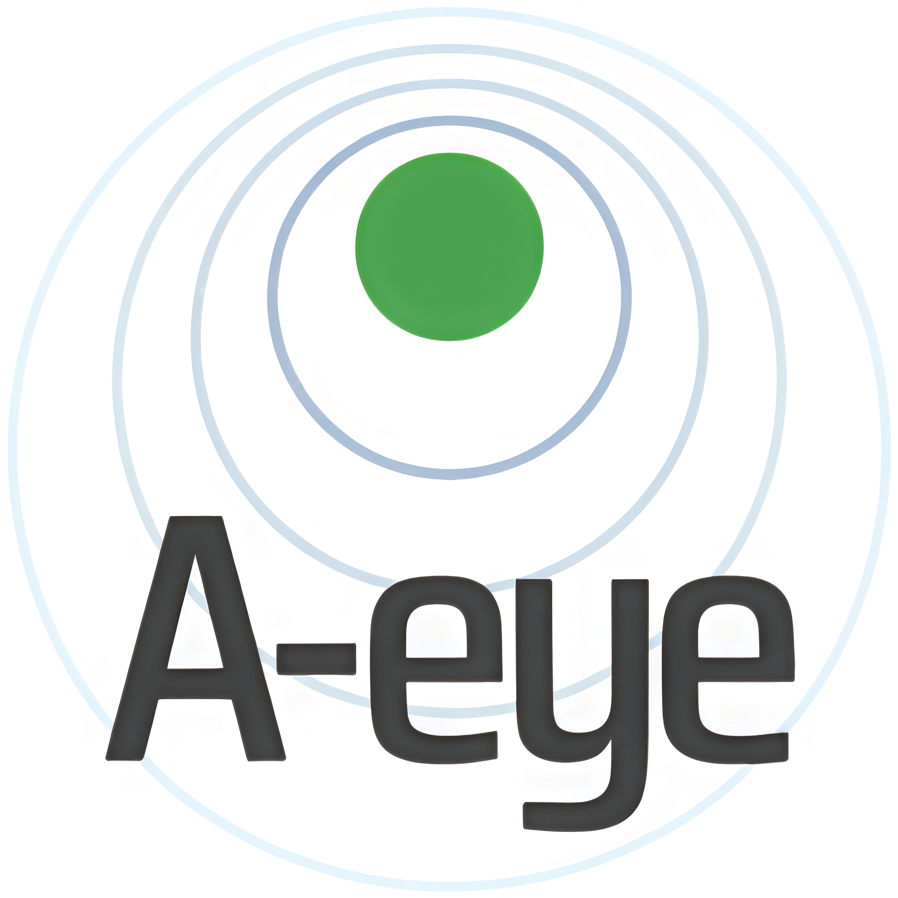
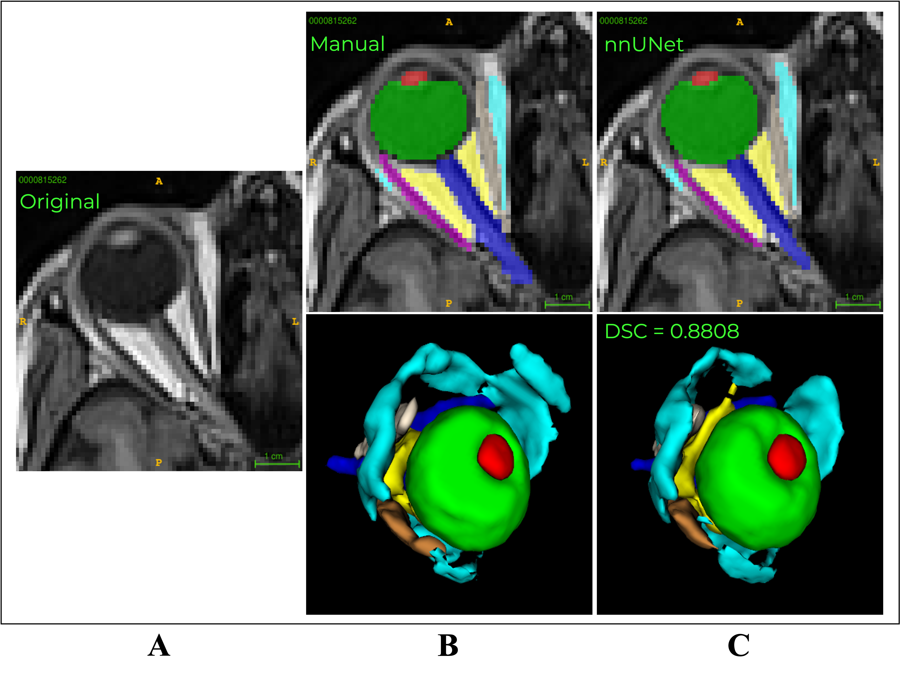
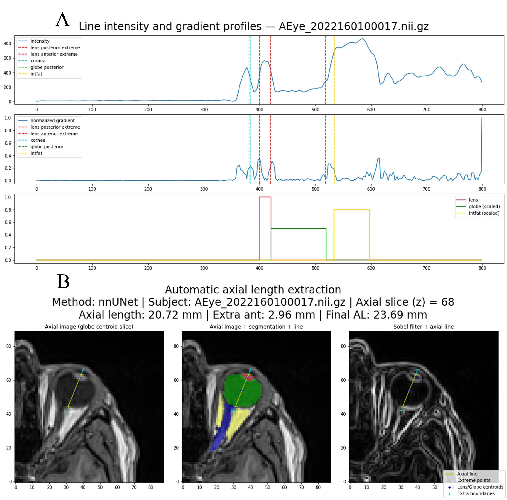
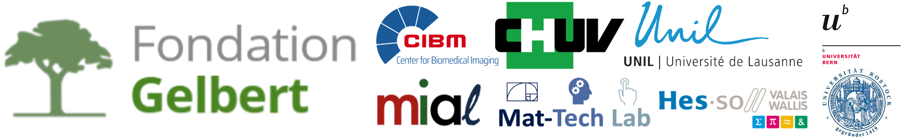

#  👁️ A-eye: Automated 3D MRI Segmentation and Morphometric Feature Extraction for Eye and Orbit Atlas Construction

## Short title: *A-eye: Automated MRI Segmentation and Morphometry of the Eye*

---



*Figure 1. Overview of the A-eye results for automated MRI eye segmentation and morphometry.*



*Figure 2. Example of axial length automatic extraction in 3D.*

## 📑 Contents

- [📚 How to Cite](#-how-to-cite)
  - [📰 Journal Paper](#-journal-paper)
  - [🧭 Eye Atlases Dataset](#-eye-atlases-dataset)
  - [🧩 Proceedings Paper](#-proceedings-paper)
- [📘 Overview](#-overview)
- [🧩 Abstract](#-abstract)
- [🧠 Keywords](#-keywords)
- [🏛️ Affiliations](#️-affiliations)
- [🌍 Web Platform](#-web-platform)
- [🛠️ Run It Yourself](#️-run-it-yourself)
  - [🐳 Using the Docker Image](#-using-the-docker-image)
  - [📦 Using the Model Weights Directly](#-using-the-model-weights-directly)
- [🧠 Repository Structure](#-repository-structure)
- [🧑‍💻 Contact](#-contact)
- [📄 License](#-license)
- [🏛️ Institutions](#️-institutions)

---

## 📚 How to Cite

If you use the A-eye pipeline, atlas, or derived datasets in your work, please cite the relevant resources below:

### 📰 Journal Paper

> Barranco J, Luyken A, Kebiri H, Stachs P, Gordaliza PM, Esteban O, Aleman Y, Sznitman R, Stachs O, Langner S, Franceschiello B, Bach Cuadra M.  
> **A-eye: Automated 3D MRI Segmentation and Morphometric Feature Extraction for Eye and Orbit Atlas Construction.**  
> *PLOS ONE*, 2025.  
> [https://doi.org/10.1371/journal.pone.0352257](https://doi.org/10.1371/journal.pone.0352257)

### 🧭 Eye Atlases Dataset

> Barranco J, Luyken A, Stachs P, Esteban O, Aleman-Gomez Y, Stachs O, *et al.*  
> **MR-Eye atlas: a large-scale atlas of the eye based on T1-weighted MR imaging** [dataset].  
> *Zenodo*, 2024.  
> [https://doi.org/10.5281/zenodo.13325371](https://doi.org/10.5281/zenodo.13325371)


*Figure 3. Visualization of the MR-Eye population atlases (female, male, and combined) and in common VCS.*

### 🧩 Proceedings Paper

> Barranco Hernandez J, Luyken A, Stachs O, Langner S, Franceschiello B, Bach Cuadra M.  
> **A-eye: automated 3D segmentation of healthy human eye and orbit structures and axial length extraction.**  
> 2025.  
> [https://doi.org/10.26039/TA7F-X088](https://doi.org/10.26039/TA7F-X088)

---

## 📘 Overview

This repository accompanies the paper:

> **Barranco J.**, Luyken A., Kebiri H., Stachs P., Gordaliza P. M., Esteban O., Aleman Y., Sznitman R., Stachs O., Langner S., Franceschiello B.†, Bach Cuadra M.†  
> **A-eye: Automated 3D MRI Segmentation and Morphometric Feature Extraction for Eye and Orbit Atlas Construction**  
> † Equal last authorship
> 📧 *Corresponding authors:*  
> <jaime.barranco-hernandez@chuv.ch>, <benedetta.franceschiello@hevs.ch>, <meritxell.bachcuadra@unil.ch>  

---

## 🧩 Abstract

In this study, we introduce **an automated 3D segmentation of the healthy human adult eye and orbit from Magnetic Resonance Images (MRI)**, aimed at advancing ophthalmic diagnostics and treatments.  

Previous works have typically relied on small sample sizes and heterogeneous imaging modalities. Here, we leverage a **large-scale dataset of T1-weighted MRI scans from 1,245 subjects** and employ the **deep learning-based nnU-Net** for MR-Eye segmentation tasks.  

Our results demonstrate **robust and accurate 3D segmentations** of the lens, globe, optic nerve, rectus muscles, and orbital fat. We further provide **automated morphometric biomarkers** such as axial length and volumetric measures, as well as benchmarking analyses correlating body mass index with eye structure volumes.  

Quality control protocols ensure the **reliability of large-scale segmentation**, enhancing the applicability of our pipeline in clinical research.  
A major outcome of this work is the **first large-scale, unbiased eye atlases (female, male, and combined)** to promote standardization of spatial normalization tools for MR-Eye.

---

## 🧠 Keywords

`MRI` · `Eye` · `MR-Eye` · `3D segmentation` · `Large-scale dataset` · `Imaging biomarkers` · `Morphometry` · `Ophthalmology` · `Atlas` · `Benchmarking` · `Axial length`

---

## 🏛️ Affiliations

1. CIBM Center for Biomedical Imaging, Lausanne, Switzerland  
2. Department of Radiology, Lausanne University Hospital (CHUV) and University of Lausanne (UNIL), Lausanne, Switzerland  
3. HES-SO University of Applied Sciences and Arts Western Switzerland  
4. The Sense Innovation and Research Center, Lausanne and Sion, Switzerland  
5. Department of Ophthalmology, Rostock University Medical Center, Rostock, Germany  
6. Karlsruhe Institute of Technology (KIT)  
7. ARTORG Center for Biomedical Engineering, University of Bern, Bern, Switzerland  
8. Department Life, Light & Matter, University of Rostock, Rostock, Germany  
9. Institute for Diagnostic and Interventional Radiology, Pediatric and Neuroradiology, Rostock University Medical Center, Rostock, Germany  

† Equal last authorship

---

## 🌍 Web Platform

🚀 The interactive web platform is now live at **[aeye.hevs.ch](https://aeye.hevs.ch)**.

Explore the MR-Eye atlases, morphometric statistics, and automated segmentation examples, or run the segmentation pipeline directly from your browser.

---

## 🛠️ Run It Yourself

Prefer to run the model locally or on your own infrastructure? Use the ready-to-use Docker image, or install the pretrained weights into your own nnU-Net setup.

### 🐳 Using the Docker Image

The Docker image, available on Docker Hub at [jaimebarran/fw_gear_aeye](https://hub.docker.com/repository/docker/jaimebarran/fw_gear_aeye), ships with nnU-Net and the pretrained weights already installed:

```bash
docker pull jaimebarran/fw_gear_aeye
```

```bash
nnUNet_predict \
    -i /input \
    -o /output \
    -tr nnUNetTrainerV2 \
    -ctr nnUNetTrainerV2CascadeFullRes \
    -m 3d_fullres \
    -p nnUNetPlansv2.1 \
    -t Task313_Eye
```

### 📦 Using the Model Weights Directly

The pretrained model weights are available on **[Zenodo](https://doi.org/10.5281/zenodo.13325371)** and can be installed into any existing nnU-Net environment:

```bash
nnUNet_install_pretrained_model_from_zip A-eye_nnUNet_model_weights.zip
nnUNet_predict -i /input -o /output -t Task313_Eye -m 3d_fullres -tr nnUNetTrainerV2
```

---

## 🧠 Repository Structure

This repository bundles three components as git submodules:

- [`a-eye_preprocessing/`](./a-eye_preprocessing) — MRI preprocessing pipeline (e.g. ANTs-based registration, bias field correction, quality control)
- [`a-eye_segmentation/`](./a-eye_segmentation) — Deep learning (nnU-Net) segmentation pipeline and atlas registration/construction scripts
- [`a-eye_web/`](./a-eye_web) — Flask web application powering [aeye.hevs.ch](https://aeye.hevs.ch)
- [`LICENSE.txt`](./LICENSE.txt) — License file

Clone with submodules using:

```bash
git clone --recurse-submodules https://github.com/jaimebarran/a-eye.git
```

---

## 🧑‍💻 Contact

For questions or collaborations, please contact:

- Jaime Barranco — [jaime.barranco-hernandez@chuv.ch](mailto:jaime.barranco-hernandez@chuv.ch), [jaime.barrancohernandez@hevs.ch](mailto:jaime.barrancohernandez@hevs.ch), [jaime.barrancohernandez@unil.ch](mailto:jaime.barrancohernandez@unil.ch)
- Benedetta Franceschiello — [benedetta.franceschiello@hevs.ch](mailto:benedetta.franceschiello@hevs.ch)  
- Meritxell Bach Cuadra — [meritxell.bachcuadra@unil.ch](mailto:meritxell.bachcuadra@unil.ch)

---

## 📄 License

This repository and associated software are distributed under the  
**“Software License Agreement for Academic Non-Commercial Research Purposes Only”**  
between **HES-SO Valais-Wallis** and **CHUV**.  

By downloading or using this software, you agree to the terms described in the [LICENSE](./LICENSE.txt) file.  
Usage is **strictly limited to academic and non-commercial research purposes**.  
For commercial or redistribution inquiries, please contact the licensors directly.

## 🏛️ Institutions



> © 2025 CIBM Center for Biomedical Imaging SP CHUV-UNIL, Lausanne, Switzerland and HES-SO University of Applied Sciences and Arts Western Switzerland, Sion, Switzerland.  
