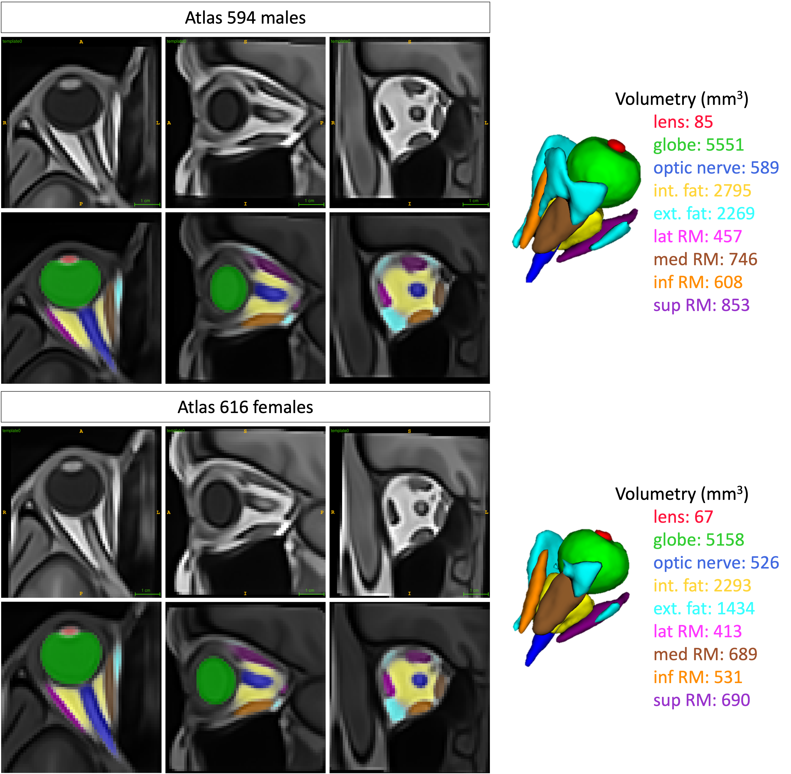

# README

This dataset presents large-scale, unbiased male and female eye atlases using MRI, constructed from 594 males and 616 females, with their corresponding probability maps of the different labels projected onto the average respective male and female templates. Additionally, the maximum probability maps are provided for each case.



## Structure

We provide a .zip file containing:

- sub_metadata.csv: dataset summary table
- template.nii.gz: atlas of the eye images (per sex)
- max_prob_map.npy and max_prob_map.nii.gz: maximum probability maps (per sex)
- prob_map.npy and prob_map.nii.gz: probability maps (per sex)

```bash
.
└── eye_atlas
    ├── female
    │   ├── max_prob_map.nii.gz
    │   ├── max_prob_map.npy
    │   ├── prob_map.nii.gz
    │   ├── prob_map.npy
    │   └── template.nii.gz
    ├── male
    │   ├── max_prob_map.nii.gz
    │   ├── max_prob_map.npy
    │   ├── prob_map.nii.gz
    │   ├── prob_map.npy
    │   └── template.nii.gz
    └── sub_metadata.csv

3 directories, 11 files
```

## Authors

Jaime Barranco, Adrian Luyken, Philipp Stachs, Oscar Esteban, Yasser Aleman, Oliver Stachs, Sönke Langner, Benedetta Franceschiello and Meritxell Bach Cuadra.

Copyright (c) - All rights reserved. Medical Image Analysis Laboratory - Department of Radiology, Lausanne University Hospital (CHUV) and University of Lausanne (UNIL), Lausanne,Switzerland & CIBM Center for Biomedical Imaging. 2024.

## Template Construction

We performed metric-based registration, consisting of rigid, affine, and then deformable registration, with ANTs toolkit [^1] to iteratively create an average mapping of the subjects grouped by sex (594 males and 616 females). We made use of the multivariate template construction tool, using as input images the right-eye-cropped ones obtained from the atlas-based segmentation method (in Supplementary Materials). Therefore, they were much smaller than the initial ones (that included the whole head). The maximum size of these right-eye-cropped images for the three axes were 61 x 70 x 68 and 77 x 95 x 94 voxels for the male and female case, respectively, and the size of the original images was 176 x 256 x 176 voxels. The size of the voxels remained 1mm3. For the deformable registration, we chose the SyN registration algorithm with the similarity metric of cross-correlation. We chose four resolution levels (8, 4, 2, 1), and iterated over each level for 80, 60, 40, and 10 iterations, respectively. Considering the reduced size of the images, we set the iteration limit (the number of iterations of the template construction) to 15, as we wanted to allow enough iterations for the template to converge and capture the variations present in our dataset. We used a 11th Gen Intel® Core™ i9-11900K × 16 processor with 64GB of RAM. The time spent to construct both atlases were 16h 15m 45s and 32h 16m 45s for the male and female cases, respectively.

```bash
#!/bin/bash

output_dir="/path/to/output_dir"
input_dir="/path/to/input_dir"

antsMultivariateTemplateConstruction2.sh \
    -d 3 \
    -o "$output_dir" \
    -i 15 \
    -g 0.2 \
    -j 16 \
    -c 2 \
    -k 1 \
    -w 1 \
    -n 1 \
    -r 1 \
    -m CC[2] \
    -q 80x60x40x10 \
    -f 8x4x2x1 \
    -s 3x2x1x0 \
    -t SyN \
    "$input_dir"*.nii.gz
```

## Probability Maps

To generate the labels on both eye atlases, we first registered them with each subject of its respective group (male or female), and project the labels obtained by the segmentation method, nnU-Net, of each subject to the atlas’ space. The whole process lasted for 25m and 39m for males and females, respectively. We then created the maximum probability map of the labels for both atlases based on majority voting. We also generated the probability maps of the labels for both atlases by adjusting the intensity of the color of each voxel per label based on its probability to belong to each one of the classes. More precisely, we assigned an RGB color to every label, converted them to HSV, multiplied the S (saturation) and V (value) components of the color space by the probability per label, reconverted to RGB for visualization, and blended the resulting RGB values for the different labels. This way, low-probability voxels (per label) will appear greyish, showing the uncertainty of those voxels belonging to a single class.

```python
""" Create maximum probability maps """

from collections import Counter

# Matrices for most likely tissue and probability of that tissue (divided by number of images)
stat_matrix = np.empty(image_shape)  # statistic matrix
prob_matrix = np.empty(image_shape)

# Probability calculation for each voxel
for x in range(image_shape[0]):
    for y in range(image_shape[1]):
        for z in range(image_shape[2]):
            voxel_values = voxel_arrays[x, y, z, :]
            freq = Counter(voxel_values)
            voxel_frequencies = freq.most_common()  # [(label, frequency), ...]
            # [0][0] most frequent value, [1][0] second most frequent value
            # [0][1] most frequent frequency, [1][1] second most frequent frequency
            voxel_value = voxel_frequencies[0][0]
            voxel_value_frequency = voxel_frequencies[0][1]
            stat_matrix[x, y, z] = voxel_value

# Save the entire max prob map to a .npy file
np.save(f'{maps_dir}/max_prob_map.npy', stat_matrix)

# Save max prob map as nifti
stat_nifti = nb.Nifti1Image(stat_matrix, sample_image.affine, sample_image.header)
nb.save(stat_nifti, f'{maps_dir}/max_prob_map.nii.gz')
```

```python
""" Compute probability of each structure per voxel """

num_labels = 10
probs = np.zeros((image_shape[0], image_shape[1], image_shape[2], num_labels))
for label in range(num_labels):
    probs[:, :, :, label] = np.count_nonzero(voxel_arrays == label, axis=3) / num_images

# Save the prob matrix to a .npy file
np.save(f'{maps_dir}/probs.npy', probs)
```

```python
""" Create ponderated RGB image for all subjects per label"""

import numpy as np
import nibabel as nb
import glob, os
import matplotlib.colors as mcolors
# matplotlib (https://matplotlib.org/stable/gallery/color/named_colors.html#sphx-glr-gallery-color-named-colors-py)

TYPE = 'female' # male, female, combined
METHOD = 'nnunet' # 'atlas' or 'nnunet'

labels_dir = f'/mnt/sda1/Repos/a-eye/Output/eye_model/{TYPE}/output/registrationToTemplate'
maps_dir = f'/mnt/sda1/Repos/a-eye/Output/eye_model/{TYPE}/output/maps/{METHOD}'

# Sample image to get the shape
sample_image_path = sorted(glob.glob(labels_dir + f'/*/labels_{METHOD}.nii.gz'))[0]
sample_image = nb.load(sample_image_path)
image_shape = sample_image.shape
print(image_shape)

# Define colors for the different labels (tissues)
colors = {
    0: [0, 0, 0],  # background - black
    1: [255, 0, 0],  # lens - tab:red
    2: [0, 255, 0],  # globe - green
    3: [0, 0, 255],  # optic nerve - tab:blue
    4: [255, 255, 0],  # intraconal fat - yellow
    5: [0, 255, 255],  # extraconal fat - cyan
    6: [255, 0, 255],  # lateral rectus muscle - magenta
    7: [144, 92, 44],  # medial rectus muscle - brown
    8: [255, 140, 0],  # inferior rectus muscle - orange
    9: [128, 0, 128],  # superior rectus muscle - purple
}

# Define names for the different labels (tissues)
label_names = {
    0: '0_background',
    1: '1_lens',
    2: '2_globe',
    3: '3_optic_nerve',
    4: '4_intraconal_fat',
    5: '5_extraconal_fat',
    6: '6_lateral_rectus_muscle',
    7: '7_medial_rectus_muscle',
    8: '8_inferior_rectus_muscle',
    9: '9_superior_rectus_muscle',
}

# Load probability matrix
# matrix = np.load('/mnt/sda1/Repos/a-eye/Output/eye_model/combined/output/maps/nnunet/voxel_arrays.npy')
# matrix_shape = matrix.shape
num_subjects = 1210  # matrix_shape[3]
probs = np.load(f'{maps_dir}/probs.npy')

# Colors to rgb using matplotlib
rgb_colors = {}
for key, value in colors.items():
    value = [x / 255 for x in value]  # normalize to [0, 1]
    rgb_colors[key] = mcolors.to_rgb(value) # no alpha channel
print("rgb: ", rgb_colors)

# Colors to hsv
hsv_colors = {}
for key, value in rgb_colors.items():
    hsv_colors[key] = mcolors.rgb_to_hsv(value)
print("hsv: ", hsv_colors)

# Create the output image
output_image_rgb = np.zeros((image_shape[0], image_shape[1], image_shape[2], 3)) # 3 channels

# Reduce intensity based on probabilities
for i in range(image_shape[0]):
    for j in range(image_shape[1]):
        for k in range(image_shape[2]):
            blended_rgb = np.zeros(3)
            for label in range(len(colors)):
                hsv = hsv_colors[label].copy()
                hsv[1] *= probs[i, j, k, label]  # Reduce intensity (Saturation)
                hsv[2] *= probs[i, j, k, label]  # Reduce intensity (Value)
                blended_rgb += mcolors.hsv_to_rgb(hsv)
            output_image_rgb[i, j, k] = blended_rgb

# Normalize to keep RGB values within [0, 1]
output_image_rgb = np.clip(output_image_rgb, 0, 1)

# Convert back to 0-255 range for visualization
output_image_rgb = (output_image_rgb * 255).astype(np.uint8)

# Save the output_rgb_image as a .npy file
np.save(f'{maps_dir}/prob_map.npy', output_image_rgb)

# Save the output_rgb_image as a nifti file
output_image_nifti = nb.Nifti1Image(output_image_rgb, sample_image.affine, sample_image.header)
nb.save(output_image_nifti, f'{maps_dir}/prob_map.nii.gz')
```

## References

[^1]: Avants, B., Tustison, N. J., & Song, G. (2009). Advanced Normalization Tools: V1.0. The Insight Journal. <https://doi.org/10.54294/uvnhin>.
